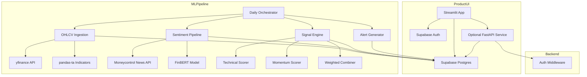

# NiveshSutra Architecture

## System Overview



## Data Flow

1. **Ingestion**: yfinance -> OHLCV table -> pandas-ta -> technical_indicators table
2. **Sentiment**: Moneycontrol news -> ticker mapping -> FinBERT scoring -> sentiment_daily table
3. **Signals**: indicators + sentiment + momentum -> weighted combination -> signals table
4. **Portfolio**: user holdings + OHLCV returns -> PyPortfolioOpt -> allocation recommendations
5. **Frontend runtime**: Streamlit pages read and write Supabase directly for auth, watchlist, holdings, alerts, and dashboard views
6. **Frontend-to-backend calls**: stock onboarding and portfolio optimization use the separate FastAPI service via `API_BASE_URL`

## Signal Engine

```text
composite_score = 0.4 * technical_score + 0.3 * sentiment_score + 0.3 * momentum_score

technical_score = 0.3*RSI + 0.3*MACD + 0.2*BB + 0.2*OBV
momentum_score = mean(5d_return, 20d_return, SMA_crossover)
sentiment_score = avg(positive_prob - negative_prob)

Signal mapping:
  composite >= 0.5  -> strong_buy
  composite >= 0.2  -> buy
  composite >= -0.2 -> hold
  composite >= -0.5 -> sell
  composite < -0.5  -> strong_sell

confidence = min(|composite| * 2, 1.0)
```

## Database Schema

| Table | Purpose | RLS |
|-------|---------|-----|
| profiles | User profiles + risk scoring | user=own |
| stocks | Nifty 50 master list | public read |
| watchlist | User stock watchlists | user=own |
| holdings | User portfolio holdings | user=own |
| ohlcv | Historical price data | public read |
| technical_indicators | Computed indicators | public read |
| news_articles | Fetched news articles | public read |
| article_sentiments | Per-article FinBERT scores | public read |
| sentiment_daily | Aggregated daily sentiment | public read |
| signal_config | Signal weight configuration | public read |
| signals | Computed buy/sell signals | public read |
| portfolio_optimizations | User optimization runs | user=own |
| optimization_allocations | Recommended allocations | user=own |
| rebalance_history | Rebalancing audit trail | user=own |
| alerts | User notifications | user=own |

## Tech Stack

| Component | Technology |
|-----------|-----------|
| Frontend | Streamlit |
| Charts | Plotly |
| Backend | FastAPI, Python 3.12 |
| Database | Supabase (Postgres 17) |
| Auth | Supabase Auth (email/password) |
| Market Data | yfinance + Moneycontrol market scrape fallback |
| Indicators | pandas-ta (RSI, MACD, BB, SMA, EMA, ATR, OBV) |
| Sentiment | ProsusAI/finbert |
| News | Moneycontrol via `moneycontrol-api` |
| Optimization | PyPortfolioOpt |

## Hosting Model

- **Frontend**: Streamlit Community Cloud, serving `streamlit_app/app.py`
- **Backend**: Render free web service, serving `services.api.main:app`
- **Database/Auth**: Supabase

This split matches the current codebase. The Streamlit app is the public product UI, while FastAPI remains available as a separate service for documented API access and backend-only workflows.
