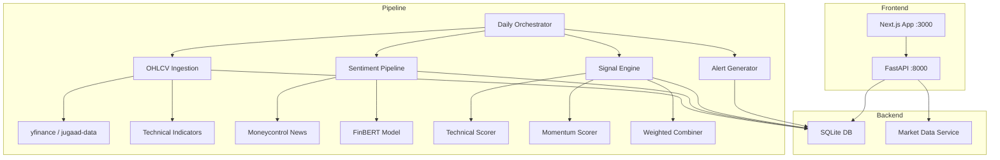

# NiveshSutra Architecture

## System Overview


```mermaid
graph TB
    subgraph Frontend
        A[Next.js App :3000] --> B[FastAPI Backend]
    end

    subgraph Backend
        B[FastAPI :8000] --> C[SQLite DB]
        B --> D[Market Data Service]
    end

    subgraph Pipeline
        E[Daily Orchestrator] --> F[OHLCV Ingestion]
        E --> G[Sentiment Pipeline]
        E --> H[Signal Engine]
        E --> I[Alert Generator]
        F --> J[yfinance / jugaad-data]
        F --> K[Technical Indicators]
        G --> L[Moneycontrol News]
        G --> M[FinBERT Model]
        H --> N[Technical Scorer]
        H --> O[Momentum Scorer]
        H --> P[Weighted Combiner]
    end

    F --> C
    G --> C
    H --> C
    I --> C
```

## Data Flow

1. **Ingestion**: yfinance/jugaad-data -> OHLCV table -> technical indicators computation -> technical_indicators table
2. **Sentiment**: Moneycontrol news -> ticker mapping -> FinBERT scoring -> sentiment_daily table
3. **Signals**: indicators + sentiment + momentum -> weighted combination -> signals table
4. **Portfolio**: user holdings + OHLCV returns -> PyPortfolioOpt -> allocation recommendations
5. **Frontend**: Next.js dashboard reads from FastAPI endpoints for stocks, signals, charts, and portfolio data

## Signal Engine

```text
composite_score = 0.4 * technical_score + 0.3 * sentiment_score + 0.3 * momentum_score

technical_score = 0.3*RSI + 0.3*MACD + 0.2*BB + 0.2*OBV
momentum_score = mean(5d_return, 20d_return, SMA_crossover)
sentiment_score = avg(positive_prob - negative_prob)

Signal mapping:
  composite >= 0.5  -> strong_buy
  composite >= 0.2  -> buy
  composite >= -0.2 -> hold
  composite >= -0.5 -> sell
  composite < -0.5  -> strong_sell

confidence = min(|composite| * 2, 1.0)
```

## Database

SQLAlchemy ORM with SQLite backend. Schema is defined in Python models and created via `init_db()`.

| Table | Purpose |
|-------|---------|
| stocks | Nifty 50 master list |
| ohlcv | Historical price data |
| technical_indicators | Computed indicators |
| news_articles | Fetched news articles |
| article_sentiments | Per-article FinBERT scores |
| sentiment_daily | Aggregated daily sentiment |
| signal_config | Signal weight configuration |
| signals | Computed buy/sell signals |
| holdings | Portfolio holdings |
| portfolio_optimizations | Optimization runs |
| optimization_allocations | Recommended allocations |
| alerts | Notifications |

## Tech Stack

| Component | Technology |
|-----------|-----------|
| Frontend | Next.js 16, Tailwind CSS, shadcn/ui, Recharts |
| Backend | FastAPI, Python 3.11+ |
| Database | SQLAlchemy + SQLite |
| Market Data | yfinance, jugaad-data |
| Indicators | RSI, MACD, BB, SMA, EMA, ATR, OBV |
| Sentiment | ProsusAI/finbert |
| News | Moneycontrol RSS |
| Optimization | PyPortfolioOpt (with NumPy/Pandas fallback) |
| Risk | Vectorized Monte Carlo VaR/CVaR |

## Runtime

- **Backend**: FastAPI on port 8000 (`uvicorn backend.main:app`)
- **Frontend**: Next.js on port 3000 (`npm run dev` in `frontend/`)
- **Database**: SQLite file at project root (`niveshsutra.db`)
- **Pipeline**: `python scripts/run_daily_pipeline.py` (run daily after market close)

All components run locally. No cloud services required.
